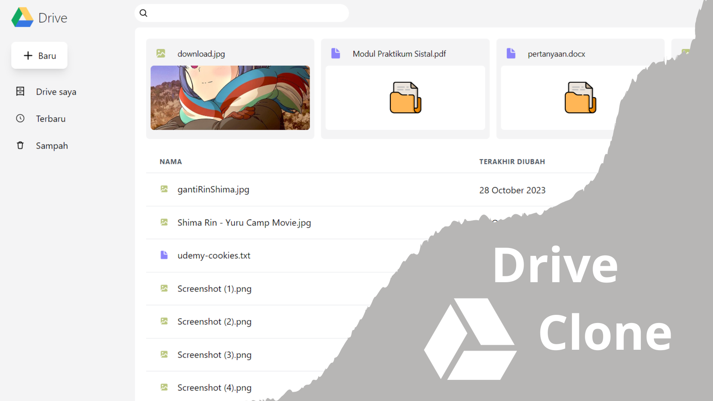

<p align="center"><strong>Drive Clone</strong></p>
<p align="center"><sub>Laravel Vue JWT Tailwind</sub></p>
<p align="center"><sub>Jangan lupa tekan 🌟</sub></p>

## Langkah untuk menggunakan drive-clone

1. ```git clone https://github.com/insanXYZ/drive-clone.git```
2. ```cd backend```
3. ```composer install```
4. ```npm install```
5. rubah ```.env.example``` menjadi ```.env```
6. buat database MySql anda dengan nama yang sama pada bagian ```DB_DATABASE``` pada ```.env```
7. ```php artisan key:generate```
8. ```php artisan migrate:fresh```
9. ```php artisan key```
10. ```cd ../frontend```
11. ```npm install```
12. ```npm run dev```

13. ## Fitur drive-clone

1. Memasukkan file
2. Download file
3. Memberi bintang pada file
4. Hapus file
